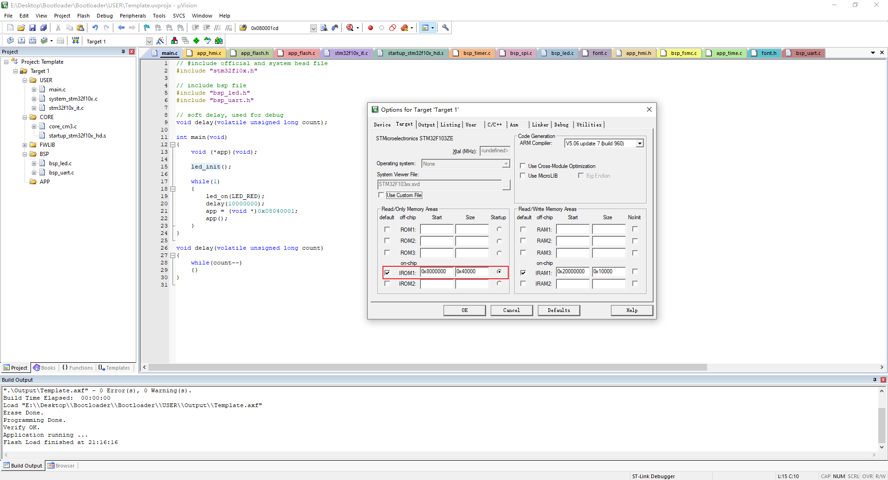
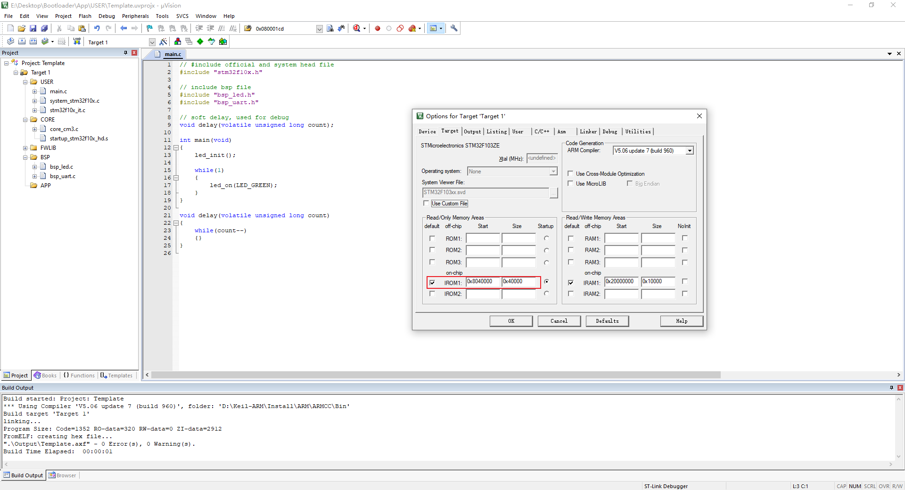

# Bootloader

## 1. 什么是 ISP，IAP，ICP

1.   ISP：在系统编程，通过 MCU 厂家预置的 Bootloader 实现代码的烧录
2.   IAP：在应用编程，Bootloader 由用户自己实现，上电后先执行用户的 Bootloader，再跳转到 APP 执行
3.   ICP：在电路编程，JTAG，SWD 等等

## 2. STM32 的启动方式

STM32 有三种启动方式：

1.   内置 Flash（一般用的都是这个）
2.   内置 SRAM
3.   系统存储器 ROM

通过芯片的 Boot0，Boot1 引脚可以选择启动方式：

| `Boot[0:1]`（`x`代表任意） | 启动方式                                           |
| -------------------------- | -------------------------------------------------- |
| `Boot1 = x，Boot0 = 0`     | 从用户闪存（内置 FLASH）启动，这是正常的工作模式。 |
| `Boot1 = 0，Boot0 = 1`     | 从系统存储器启动，这种模式启动的程序功能由厂家设置 |
| `Boot1 = 1，Boot0 = 1`     | 从内置 SRAM 启动，这种模式可以用于调试             |

通过设置 Boot 引脚的目的就是决定哪个地址（Main Flash，System Flash，SRAM）映射到 0x00000000

## 3. 第一个 Bootloader--启动 App

**运行环境：野火指南者开发板，MCU：STM32F103VET6，Keil 5.32**

Bootloader 最基本的作用就是启动 App

### 3.1 Bootloader 设置与代码编写

**Step 1：**

从 Bootloader 跳转到 App 使用函数指针来实现：`void (*app)(void)`，需要跳转的函数地址：`0x08040000`

**代码里的跳转地址为什么是`0x08040001`，这是因为 Cortex-M3 采用了 Thumb 指令集，bit[0] 为 1 就是告诉编译器这是一条 Thumb 指令**

**Step 2：**

在 Target 选项卡里，设置 Bootloader 代码的起始地址和内存空间大小分别为`0x08000000`和`0x4000`

### 3.2 App 设置与代码编写

**Step 1：**

在 Target 选项卡里，设置 App 代码的起始地址和内存空间大小分别为`0x08040000`和`0x4000`

### 3.3 程序下载验证

将 Bootloader 和 App 分别烧写到单片机内，可以看到，单片机先亮红灯，再亮绿灯

## 100. 参考文章

1.https://www.cnblogs.com/schips/p/13081576.html

