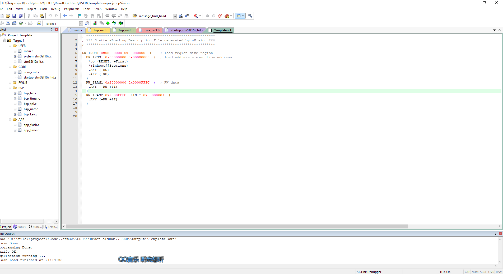

# 4. 软复位后保存 RAM 数据


```C
uint8_t reset_data __attribute__((at(0x2000FFFF)));

int main(void)
{    
    NVIC_PriorityGroupConfig(NVIC_PriorityGroup_4);
    
    uart1_init();
    led_init();
    timer6_init();
		
	
    while(1)
    {
        message_loop();
			
		if( soft_reset_flag == 1 )
		{
			reset_data++;
			
			NVIC_SystemReset();
		}
    }
}
```

初次上电的时候，地址 0x2000FFFF 处的数据为随机值


调用 `NVIC_SystemReset();` 函数进行软复位后，地址 0x2000FFFF 处的值 +1


查看散列文件，发现增加了一个未初始化的 RAM 段



